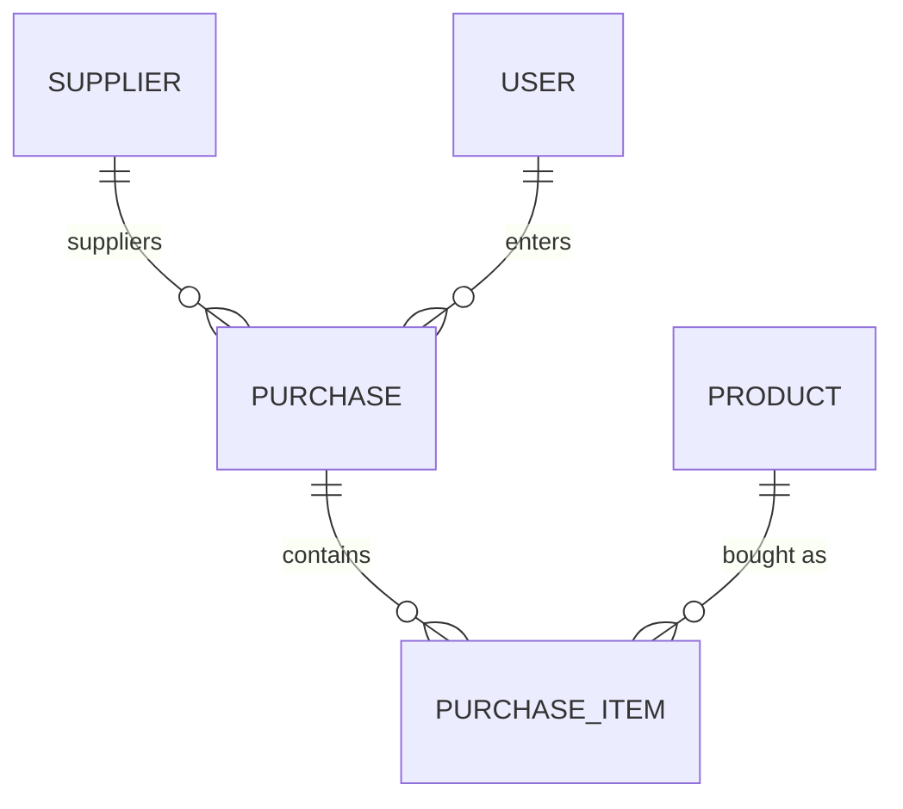

# Controle de Compras de Manutenção

Sistema para controle de compras de peças e materiais de manutenção: cadastro de fornecedores e produtos, lançamento de notas de compra (manual, com leitor de código de barras/SEFAZ-SC futuramente) e histórico de itens comprados.

## Stack

**Backend**
- Node.js + TypeScript + Express 5
- Prisma ORM + PostgreSQL
- Autenticação via JWT (bcrypt para hash de senha)
- Validação de payloads com Zod

**Frontend**
- Vue 3 + TypeScript + Vite
- Naive UI (componentes) + Pinia (estado) + Vue Router
- Axios para consumo da API

**Infra**
- PostgreSQL via Docker Compose

## Estrutura do repositório

```
.
├── backend/          # API REST (Express + Prisma)
│   ├── prisma/        # schema, migrations e seed
│   └── src/
│       ├── controllers/
│       ├── services/
│       ├── routes/
│       ├── schemas/    # validação Zod
│       └── middlewares/
├── frontend/         # SPA (Vue 3 + Vite)
│   └── src/
│       ├── views/
│       ├── components/
│       ├── stores/     # Pinia
│       ├── services/    # cliente Axios / chamadas à API
│       └── router/
├── docs/             # ERD e collection do Postman
├── layout/           # mockups do design system (referência visual)
├── docker-compose.yml # serviço Postgres
├── TODO.md            # plano de trabalho por fases/dias
└── TODO-design-refactor.md
```

## Modelo de dados

Entidades principais: `Supplier`, `Product`, `User`, `Purchase` e `PurchaseItem`.



Diagrama completo em [docs/erd.md](docs/erd.md).

## Como rodar

### Pré-requisitos
- Node.js LTS
- Docker + Docker Compose

### 1. Banco de dados

```bash
cp .env.example .env
docker compose up -d
```

### 2. Backend

```bash
cd backend
npm install
cp .env.example .env   # ajuste DATABASE_URL / JWT_SECRET
npx prisma migrate dev
npm run seed            # opcional: popula dados de exemplo
npm run dev              # http://localhost:3000
```

### 3. Frontend

```bash
cd frontend
npm install
npm run dev               # http://localhost:5173
```

> Em ambiente multi-máquina, sempre rode `npm install` após um `git pull` que altere `package.json`.

## API

Rotas expostas pelo backend (prefixo `http://localhost:3000`):

| Recurso | Rota base | Autenticação |
|---|---|---|
| Auth | `/auth` | — |
| Fornecedores | `/suppliers` | leitura pública, escrita autenticada |
| Produtos | `/products` | leitura pública, escrita autenticada |
| Compras | `/purchases` | leitura pública, escrita autenticada |

Uma collection Postman pronta para uso está em [docs/api-collection.postman_collection.json](docs/api-collection.postman_collection.json).

## Documentação adicional

- [TODO.md](TODO.md) — plano de desenvolvimento detalhado, por dia
- [TODO-design-refactor.md](TODO-design-refactor.md) — refatoração do design system do frontend
- [docs/erd.md](docs/erd.md) — modelo de dados completo
