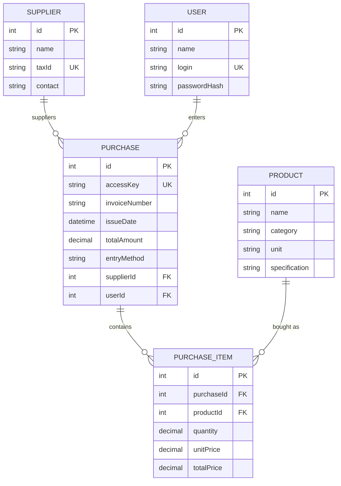

# Database ERD

```mermaid
erDiagram
    SUPPLIER ||--o{ PURCHASE : suppliers
    USER ||--o{ PURCHASE : enters
    PURCHASE ||--o{ PURCHASE_ITEM : contains
    PRODUCT ||--o{ PURCHASE_ITEM : "bought as"

    SUPPLIER {
        int id PK
        string name
        string taxId UK
        string contact
    }
    PRODUCT {
        int id PK 
        string name
        string category
        string unit
        string specification
    }
    USER {
        int id PK 
        string name
        string login UK
        string passwordHash
    }
    PURCHASE{
        int id PK
        string accessKey UK
        string invoiceNumber
        datetime issueDate
        decimal totalAmount
        string entryMethod
        int supplierId FK
        int userId FK
    }
    PURCHASE_ITEM {
        int id PK
        int purchaseId FK
        int productId FK
        decimal quantity
        decimal unitPrice
        decimal totalPrice
    }
```