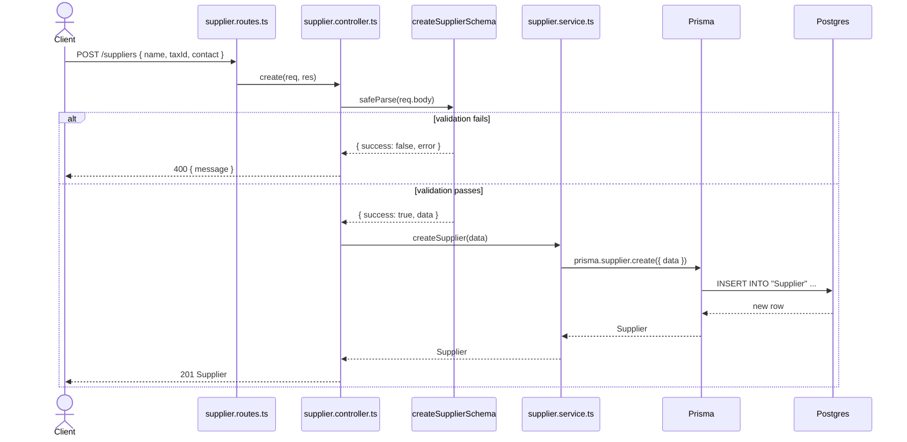
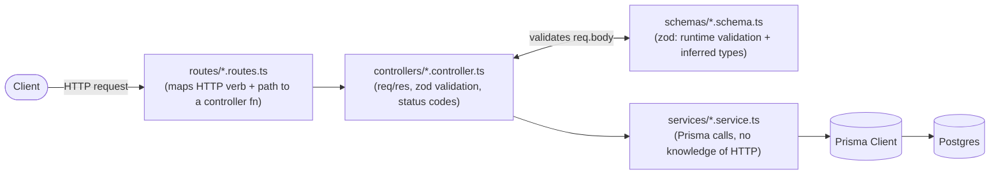

# Request Flow

How a request moves through the layered backend architecture (`routes` → `controllers` → `services` → Prisma → Postgres). Example below traces `POST /suppliers`; every other resource (`Product`, `Purchase`, ...) follows the same shape.

## Layers

Key rule: only the **controller** touches `req`/`res` or raw untrusted input. Once `zod` validates the payload, everything below (`service`, `Prisma`) trusts the data's shape.
